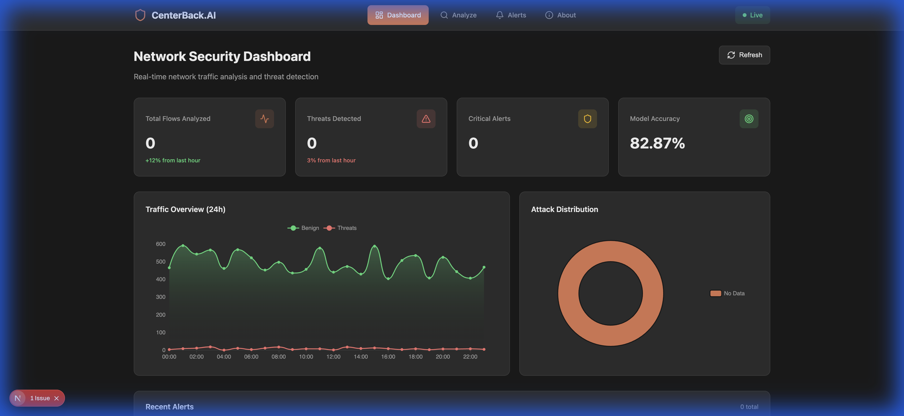

# CenterBack.AI

> AI-Powered Network Intrusion Detection System
> "Your Network's Last Line of Defense"

CenterBack.AI is your network's last line of defense by using machine learning to detect and classify network intrusions in real-time.



## Features

- **Multi-class Classification**: Detects 14 different attack types
- **Real-time Analysis**: Fast inference via REST API
- **Interactive Dashboard**: Visualize threats with Apache ECharts
- **CSV Upload**: Batch analyze network flow data
- **Model Accuracy**: Demo model reports ~82.87% accuracy on synthetic CICIDS2017-shaped data (train locally to enable real inference)

## Tech Stack

- **Backend**: Python, FastAPI
- **ML**: scikit-learn (Random Forest)
- **Frontend**: Next.js, React, TypeScript
- **Visualization**: Apache ECharts
- **Database**: Supabase (PostgreSQL)
- **Deployment**: Google Cloud Run

## Quick Start

### Prerequisites

- Python 3.11+
- Node.js 18+
- npm or yarn

### Backend Setup

```bash
cd backend
python -m venv venv
source venv/bin/activate  # Windows: venv\Scripts\activate
pip install -r requirements.txt

# Train a model (first time only)
# Option A (quick demo): generate synthetic sample data
python ml/generate_sample.py
python ml/train.py
#
# Option B: download full CICIDS2017 dataset (manual/Kaggle), then train
# python ml/download_data.py
# python ml/train.py

# Run server
uvicorn app.main:app --reload
```

### Frontend Setup

```bash
cd frontend
npm install
npm run dev
```

### Access

- Frontend: http://localhost:3000
- Backend API: http://localhost:8000
- API Docs: http://localhost:8000/docs

## API Endpoints

| Method | Endpoint                | Description          |
| ------ | ----------------------- | -------------------- |
| GET    | `/health`             | Health check         |
| GET    | `/api/stats`          | Dashboard statistics |
| GET    | `/api/stats/attacks`  | Attack distribution  |
| GET    | `/api/alerts`         | Recent detections    |
| GET    | `/api/alerts/{id}`    | Alert detail         |
| POST   | `/api/classify`       | Classify single flow |
| POST   | `/api/classify/batch` | Classify CSV file    |
| POST   | `/api/classify/sample`| Classify demo sample |
| GET    | `/api/model/info`     | Model metadata       |

## Attack Types Detected

| Category       | Attack Types                                                   |
| -------------- | -------------------------------------------------------------- |
| DoS/DDoS       | DDoS, DoS Hulk, DoS GoldenEye, DoS Slowloris, DoS Slowhttptest |
| Reconnaissance | PortScan                                                       |
| Brute Force    | FTP-Patator, SSH-Patator                                       |
| Web Attacks    | Brute Force, XSS, SQL Injection                                |
| Other          | Bot, Infiltration, Heartbleed                                  |

## Dataset

Uses the **CICIDS2017** dataset from the Canadian Institute for Cybersecurity:

- 2.8M labeled network flows
- 78 features per flow
- 15 classes (1 benign + 14 attack types)

## Project Structure

```
centerback.ai/
├── backend/           # Python FastAPI backend
├── frontend/          # Next.js frontend
├── CLAUDE.md          # AI context file
├── Codex.md           # AI context file (Codex)
├── RULES.md           # Coding standards
├── TASK.md            # Progress tracker
├── ROADMAP.md         # Future plans
└── README.md          # This file
```

## Environment Variables

Copy `.env.example` to `.env` and fill in:

```env
# Backend
# Optional (not wired yet in MVP)
SUPABASE_URL=your_supabase_url
SUPABASE_KEY=your_supabase_key

# Optional: override model artifact path (defaults to backend/ml/models/random_forest_v1.joblib)
MODEL_PATH=ml/models/random_forest_v1.joblib

# Frontend
NEXT_PUBLIC_API_URL=http://localhost:8000
```

## Deployment

```bash
# Build and deploy to Cloud Run
gcloud run deploy centerback-ai \
  --source . \
  --region us-central1 \
  --allow-unauthenticated
```

## Roadmap

See [ROADMAP.md](./ROADMAP.md) for Phase 2 features including:

- Autoencoder for zero-day detection
- Real-time streaming
- Alert notifications
- Model explainability

## License

MIT

## Author

Built with AI assistance using Claude
